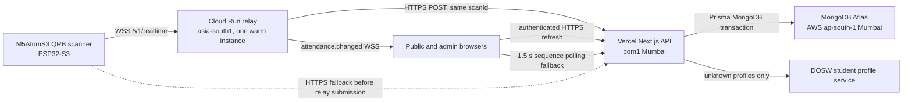
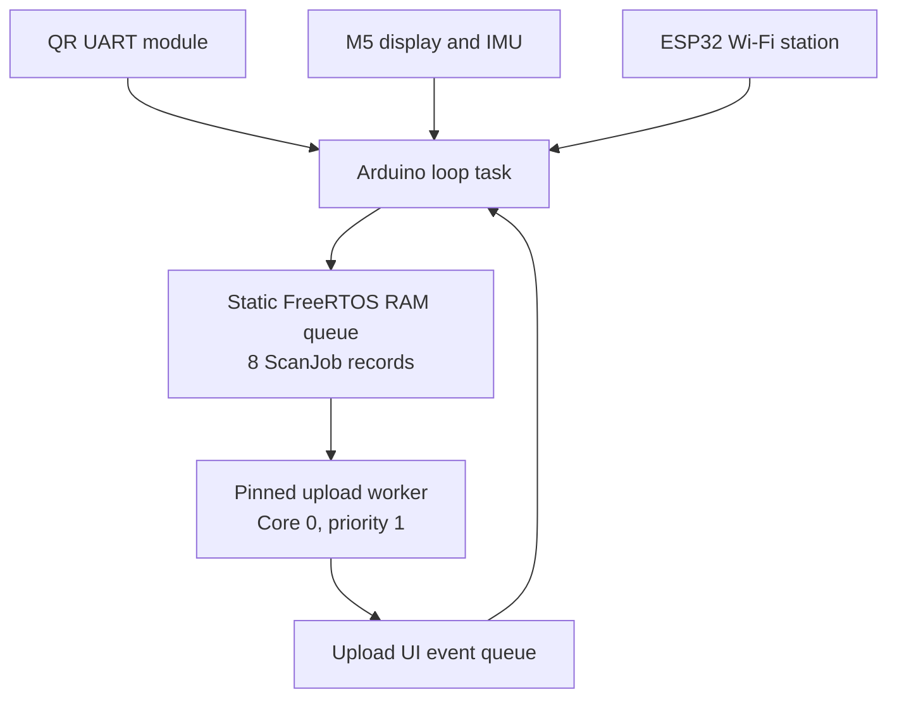
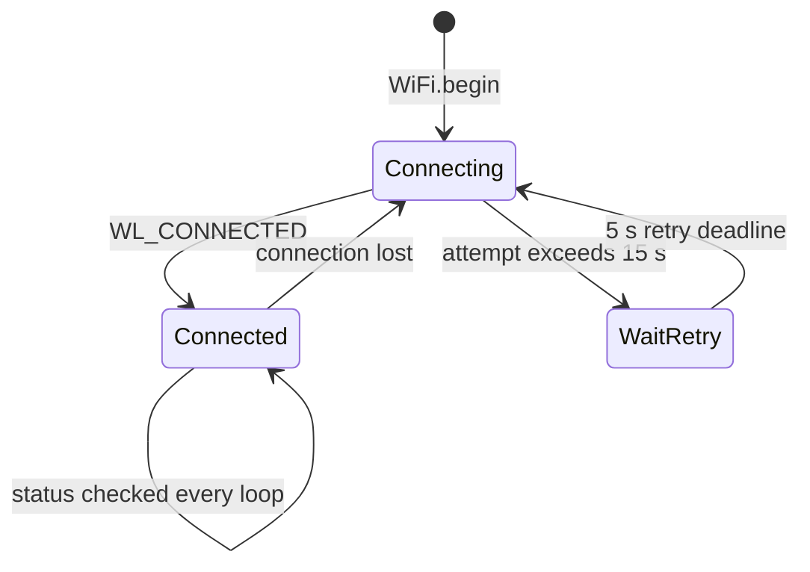
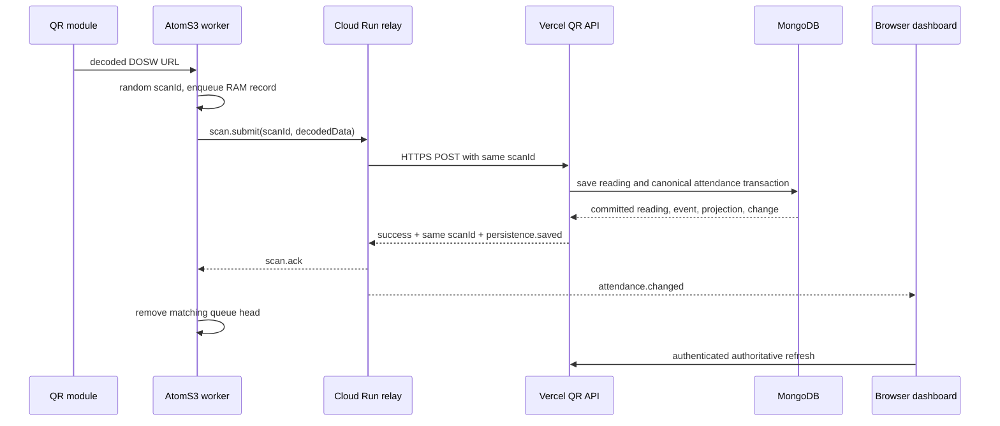
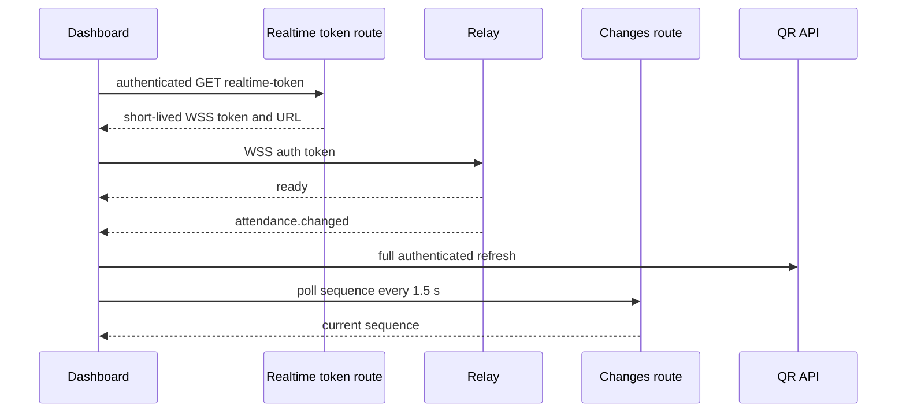

# QR Biometric ICC Architecture

## Purpose

The QR Biometric ICC system records attendance from an M5AtomS3 QR scanner and
updates authenticated dashboards as soon as MongoDB has durably committed the
canonical attendance result. It uses a persistent WebSocket connection for low
latency, while retaining the same idempotent HTTPS API as a safe fallback.

The authoritative state is MongoDB. The relay accelerates delivery; it does not
invent a successful scan or own attendance data.

## Production Topology



All latency-sensitive services are in Mumbai:

| Component | Placement | Reason |
| --- | --- | --- |
| QR relay | Google Cloud Run `asia-south1` | Near the scanner and database |
| Next.js functions | Vercel `bom1` | Near MongoDB |
| MongoDB | AWS `ap-south-1` | Authoritative attendance storage |
| Browser static assets | Vercel CDN | Served near the browser |

`vercel.json` enforces `bom1` for Vercel Functions. The Vercel build machine
may be in another region; function execution is what matters for requests.

## Firmware

Primary source files:

- `arduino_code/qr_logger_icc_m5_qr_extended_timeout/qr_logger_icc_m5_qr_extended_timeout.ino`
- `arduino_code/qr_logger_icc_m5_qr_extended_timeout/qr_scanner_policy.h`
- `arduino_code/qr_logger_icc_m5_qr_extended_timeout/qr_relay_policy.h`
- `arduino_code/qr_logger_icc_m5_qr_extended_timeout/qr_wifi_policy.h`

### Hardware and initialization

- Board: M5AtomS3 with ESP32-S3-PICO-1.
- QR module: M5UnitQRCode UART, ESP RX GPIO 5 and ESP TX GPIO 6 at 115200 baud.
- M5Unified supplies display, button, speaker, IMU, and power integration.
- The QR module uses manual trigger mode.
- Wi-Fi uses station mode with modem sleep disabled by `WiFi.setSleep(false)`.
- The default firmware build uses ignored `secrets.h`. It is never committed,
  logged, placed in a URL, or sent to browser code.
- A separately provisioned QRB-001 uses ignored `secrets_qrb001.h` only when
  compiled with `QRB001_BUILD`. This keeps multiple scanners from sharing an
  identity or API key.

### Tasks and ownership



The main loop owns scanner, IMU, display, and Wi-Fi association. The uploader
owns network delivery, TLS clients, NTP synchronization, and the WebSocket
client. This keeps a slow cloud request off the QR decode loop.

### QR scan flow

1. While awake, the scanner is retriggered every 1.6 seconds.
2. `readQrFrame()` collects library fragments for up to 450 ms and waits for an
   80 ms quiet period. It accepts at most 512 bytes.
3. The device accepts only an HTTPS DOSW StudentProxy URL with a nonempty `id`.
   Invalid QR data is rejected before any network request.
4. A matching QR shown again within 30 seconds displays `DUP` and is not sent.
   This prevents a QR left in front of the reader from creating competing
   attendance requests. `DUP` is not a Wi-Fi or cloud error.
5. A valid, nonduplicate QR gets a cryptographically random 24-hex `scanId` and
   is appended to the static queue. The display immediately shows `SCANNED`.
6. The worker retains the queue head until an exact durable acknowledgement. It
   removes exactly one record only after that acknowledgement.

### Scanner-only idle mode

After 10 seconds without IMU motion, the firmware sends only QR trigger-off.
It does not use ESP deep sleep. The display, CPU, Wi-Fi state machine, upload
worker, and relay connection remain active. Button press or sufficient movement
reenables the QR trigger immediately.

### Wi-Fi recovery

`maintainWiFiConnection()` runs on every `loop()` iteration, before the idle
return, so it runs whether the QR trigger is on or off.



Rules:

- Startup does not block on Wi-Fi; scanning initializes immediately.
- Wi-Fi auto-reconnect is enabled and SDK credential persistence is disabled.
- Every connection attempt has a 15-second maximum. A stalled attempt is
  disconnected, then a new non-blocking `WiFi.begin()` is scheduled five seconds
  later.
- The retry policy does not treat `WL_IDLE_STATUS` as permanently active after
  its own attempt timed out. This fixes the prior long-running failure where the
  device could remain disconnected until a reset.
- `W:OK` means ESP32 has a station connection and IP. `W:--` means not
  connected; the automatic retry state machine is running.
- On real recovery, the main loop wakes the upload worker and it restarts NTP
  timing. The upload worker resets its WebSocket transport and reconnects it
  only after Wi-Fi is back.
- A Wi-Fi loss during an active relay acknowledgement wait immediately stops that
  wait, retains the scan, and lets the worker rebuild the transport after Wi-Fi
  returns.
- No reconnect loop blocks QR decoding or screen updates.

### Device-to-cloud delivery



The scanner WebSocket uses the Cloud Run hostname and the `GTS Root R1` CA. The
direct HTTPS API uses `ISRG Root X1`. Both TLS paths validate certificates.

### Relay and HTTPS decisions

- The scanner authenticates by sending its device ID, API key, and MAC in the
  first encrypted WebSocket message. Credentials are never query parameters.
- Before accepting scans, the relay validates the scanner against the existing
  API using a `device-online` request.
- Once a `scan.submit` was sent successfully, the worker waits up to 25 seconds
  for that relay attempt and retries the same queued `scanId` through the relay.
  It does not launch a concurrent direct HTTPS request.
- HTTPS is used immediately only when the relay was unavailable before a send.
  It posts the same `scanId`, so a retry is idempotent.
- Transport faults, malformed responses, and 5xx responses remain queued with
  exponential retry from 2 to 60 seconds.
- Explicit invalid QR, 413, 422, or a confirmed scan-ID collision are terminal.
  Provisioning errors such as 400, 401, 403, and noncollision 409 are retained
  and checked again after 60 seconds.
- A successful screen state (`IN`, `OUT`, `MARKED`, then `UPLOADED`) requires
  `2xx`, `success: true`, exact matching `scanId`, and
  `persistence.status: "saved"`.

### RAM queue tradeoff

The queue is intentionally RAM-only at the user's request to remove LittleFS,
Preferences, profile caching, and flash writes. It holds eight pending scans.
If power is lost or the board resets before cloud acknowledgement, those
pending scans are lost. This is the unavoidable tradeoff for no device-side
persistent storage. A full queue displays `Q FULL` and never silently overwrites
an earlier scan.

## Cloud Run Realtime Relay

Source: `relay/qr-realtime/`.

### Endpoints and protocol

| Endpoint | Purpose |
| --- | --- |
| `GET /health` | Readiness and protocol version |
| `GET /metrics` | In-memory connection and upstream latency counters |
| `WSS /v1/realtime` | Version 1 device and dashboard protocol |

Every JSON message contains `v: 1`. WebSocket limits are 16 KiB, compression is

Scanner protocol:

```text
client -> { v: 1, type: "auth", role: "scanner", deviceId, apiKey, macAddress }
server -> { v: 1, type: "ready", role: "scanner", heartbeatMs, ... }
client -> { v: 1, type: "scan.submit", scanId, decodedData }
server -> { v: 1, type: "scan.ack", scanId, httpStatus, result }
```

`scan.ack` is emitted only for the exact durable API response. Other upstream
outcomes become `scan.result` with a status and retryable signal.

Dashboard protocol:

```text
client -> { v: 1, type: "auth", role: "dashboard", token }
server -> { v: 1, type: "ready", role: "dashboard", ... }
server -> { v: 1, type: "attendance.changed", scanId, deviceId, entryState, changedAt }
```

The notification does not contain student profile data. The browser refreshes
its authenticated API data after receiving it.

### Relay reliability and security

- Scanner API keys exist only in the relay connection memory and the encrypted
  upstream HTTPS request.
- Browser/dashboard tokens are HMAC-SHA256, audience-bound, random-nonce tokens
  issued by Vercel for 60 seconds. They never contain a device API key.
- The relay accepts only an HTTPS upstream origin in production.
- Authentication must complete within five seconds; it also validates scanner
  device status upstream.
- Ping/pong heartbeat runs every 15 seconds. Dead sockets are terminated.
- Only one scanner socket is active for a device ID; a newer connection
  supersedes the old socket.
- Scanner rate is limited to five submissions per second.
- A single-flight map keyed by `deviceId:scanId` joins retries to a still-running
  upstream operation. Durable results are cached briefly; transient results are
  not cached, so the next retry can reach the API.
- Outgoing buffers are bounded. The relay is configured for one warm, maximum
  one Cloud Run instance because audience fan-out is process-local. Do not raise
  the maximum without adding shared fan-out such as Pub/Sub or Redis.

## Vercel Application and MongoDB

### Authentication and QR ingestion

`app/api/qr-biometric-icc/route.ts` is the authoritative QR API.

1. It verifies a registered, enabled `QR_SCANNER` device and its hashed API key.
2. It validates/locks the MAC address when supplied. Device activity writes that
   do not affect authorization are deferred with `after()`.
3. It validates the DOSW QR URL and exact 24-hex `scanId`.
4. It resolves known student profiles from indexed `StudentIdentity.doswUrl`
   first. This avoids an external profile fetch for known students.
5. Unknown profiles may call DOSW with an eight-second bound. Profile/photo work
   outside durable attendance semantics can run after the main response.
6. It saves the raw `QrBiometricReading`, then runs the canonical attendance
   transaction.
7. It responds durable success only after canonical processing is `APPLIED` or
   `SUPPRESSED_DUPLICATE`, with the exact original `scanId` and `saved` status.

Replaying the same `scanId` and payload is safe. A reused `scanId` with different
decoded data is a conflict. Tombstones prevent an administrator-deleted scan
from being restored by a retry.

### Canonical attendance and change feed

`lib/attendance-ledger.ts` is the canonical attendance writer. In MongoDB
transactions it maintains:

- `StudentIdentity`: normalized enrollment, DOSW URL, profile, and photo.
- `AttendanceEvent`: idempotent source event with a unique deduplication key.
- `AttendanceProjection`: current canonical IN/OUT state per student.
- `AttendanceChange`: ordered outbox record and snapshot.
- `AttendanceFeedCounter`: transactionally incremented global sequence.
- `QrBiometricReading`: raw log synchronized to canonical effective state.

The transactional change outbox lets dashboards detect durable updates without
trusting process-local memory or WebSocket delivery.

### Dashboard synchronization



- `app/api/qr-biometric-icc/realtime-token/route.ts` authenticates the browser
  session and returns a private, no-store relay token and WSS URL.
- `hooks/use-qr-realtime-updates.ts` uses WebSocket notifications while visible,
  reconnects with bounded jitter, and coalesces concurrent refresh requests.
- `app/api/qr-biometric-icc/changes/route.ts` returns only the current durable
  sequence and asks clients to poll every 1.5 seconds.
- Public/staff and admin dashboards retain their sequence polling and periodic
  full refresh fallback. A relay restart or missed notification cannot leave the
  dashboard permanently stale.

## Failure and Recovery Matrix

| Failure | Device behavior | Cloud/dashboard behavior |
| --- | --- | --- |
| Wi-Fi disconnect | `W:--`; main loop retries forever without reset; QR/UI remain active | Upload waits; relay transport resets; reconnect resumes delivery |
| Wi-Fi attempt stalls | Abort at 15 s, wait 5 s, begin again even in `WL_IDLE_STATUS` | No manual reset required |
| Relay unavailable before a scan send | Same `scanId` uses direct HTTPS | API persists normally; dashboard polling still observes it |
| Relay fails after a scan send | Retain queue head and retry relay; no competing direct POST | Single-flight relay avoids duplicate upstream transactions |
| Vercel/Mongo transient fault | Retain record with exponential retry | No durable ACK or notification is emitted |
| Device auth/MAC error | Queue retained; `CONFIG ERR`, `BAD KEY`, or `MAC/ID ERR` | Correct provisioning must be restored |
| Invalid QR | Rejected locally or terminally removed only for explicit invalid status | No attendance change |
| Same QR held in front of scanner | `DUP` for 30 seconds | Avoids duplicate records and transaction contention |
| Browser WSS disconnect | Browser reconnects when visible | 1.5-second sequence polling and periodic refresh self-heal |
| Relay instance restart | Scanner reconnects, browser reconnects | MongoDB outbox/polling retain the authoritative state |
| ESP reset/power loss | Pending RAM-only records are lost | Previously acknowledged records remain durable |

## Operations

### Health checks

- Relay: `GET /health` must return `status: ready` and protocol version 1.
- Relay: `GET /metrics` exposes scanner/audience counts, durable ACK count,
  upstream failures, request count, and recent upstream latency.
- Vercel: production QR API and `/changes` return private 401 without a session,
  proving the routes are live without exposing data.
- Vercel response headers should contain `X-Vercel-Id: bom1::bom1::...`.
- Arduino serial monitor is 115200 baud. Important messages include Wi-Fi loss,
  reconnect scheduling/restoration, relay ready, durable acknowledgement, and
  upload retry classification.

### Normal display interpretation

| Screen | Meaning |
| --- | --- |
| `W:OK` | Wi-Fi station connected |
| `W:--` | Wi-Fi disconnected; automatic recovery is running |
| `SCANNED` | Valid QR is in the RAM queue |
| `IN` / `OUT` / `MARKED` | Exact durable attendance acknowledgement received |
| `UPLOADED` | Queue is drained after cloud acknowledgement |
| `DUP` | Same QR ignored during the 30-second local suppression window |
| `OFFLINE` / `RETRY` | Record retained for automatic delivery retry |
| `CONFIG ERR` | Device key, MAC, ID, or payload provisioning rejection |
| `Q FULL` | Eight volatile queue slots are occupied |
| `QR OFF` | Scanner-only idle; Wi-Fi and uploader are still running |

## Verification Commands

Run firmware checks from the repository root:

```powershell
& "C:\Users\rajra\AppData\Local\Programs\Arduino IDE\resources\app\lib\backend\resources\arduino-cli.exe" compile --fqbn m5stack:esp32:m5stack_atoms3 "arduino_code\qr_logger_icc_m5_qr_extended_timeout"
& "C:\Users\rajra\AppData\Local\Programs\Arduino IDE\resources\app\lib\backend\resources\arduino-cli.exe" upload --fqbn m5stack:esp32:m5stack_atoms3 --port COM7 "arduino_code\qr_logger_icc_m5_qr_extended_timeout"
g++ -std=c++17 tests/qr_wifi_policy_test.cpp -o qr_wifi_policy_test.exe
.\qr_wifi_policy_test.exe
```

### QRB-001 isolated build

Provision the QRB-001 device record and MAC lock before flashing. Create the
ignored `secrets_qrb001.h` from `secrets_qrb001.h.example` with QRB-001's own
device ID, API key, and Wi-Fi settings. Never replace the default `secrets.h`.

```powershell
$buildPath = Join-Path $env:TEMP "qrb001-firmware-build"
& "C:\Users\rajra\AppData\Local\Programs\Arduino IDE\resources\app\lib\backend\resources\arduino-cli.exe" compile --fqbn m5stack:esp32:m5stack_atoms3 --build-property "compiler.cpp.extra_flags=-DQRB001_BUILD" --build-path $buildPath "arduino_code\qr_logger_icc_m5_qr_extended_timeout"
& "C:\Users\rajra\AppData\Local\Programs\Arduino IDE\resources\app\lib\backend\resources\arduino-cli.exe" upload --fqbn m5stack:esp32:m5stack_atoms3 --port COM8 --build-path $buildPath "arduino_code\qr_logger_icc_m5_qr_extended_timeout"
```

Leave `QRB001_BUILD` undefined for the default QRB-201 build; it then uses
`secrets.h` and the normal compile/upload commands above.

Run application checks:

```powershell
npm test
npx tsc --noEmit
npm run build
```

Do not place secrets in source, documentation, browser variables, command
output, or Git. Use ignored firmware secrets, Vercel server-only variables, and
Google Secret Manager for deployment credentials.
