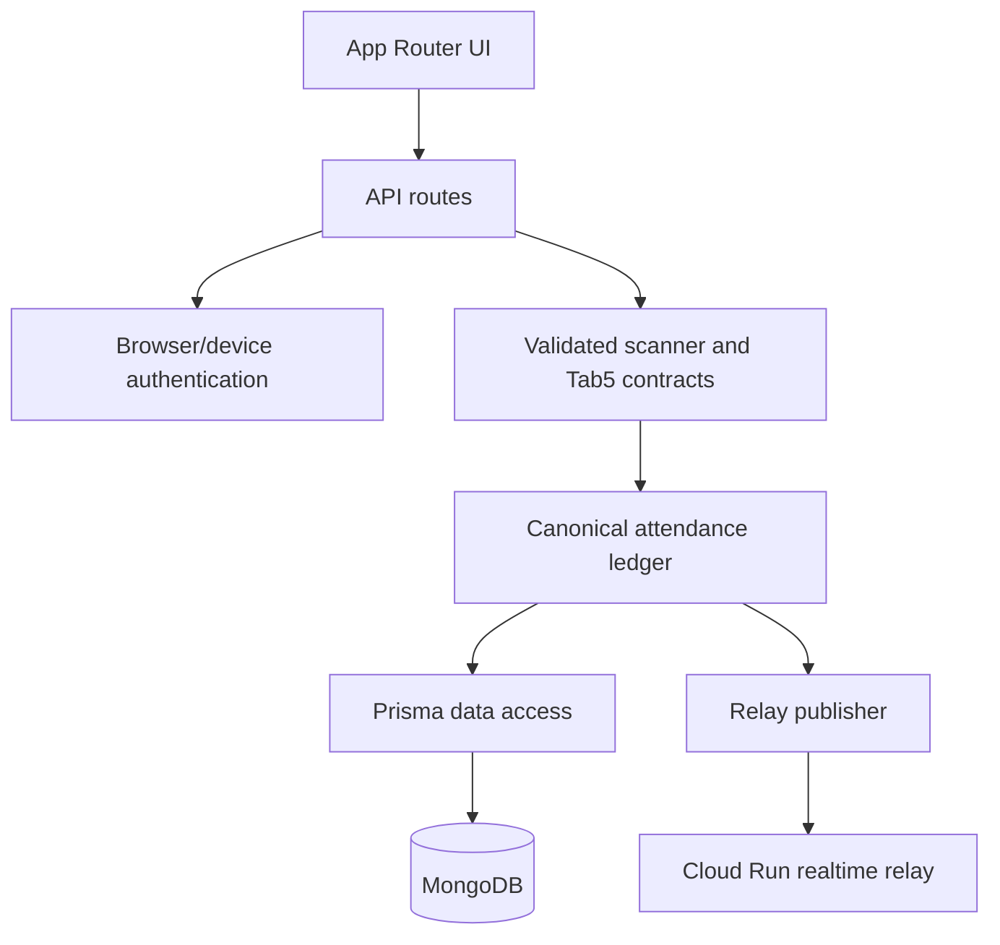
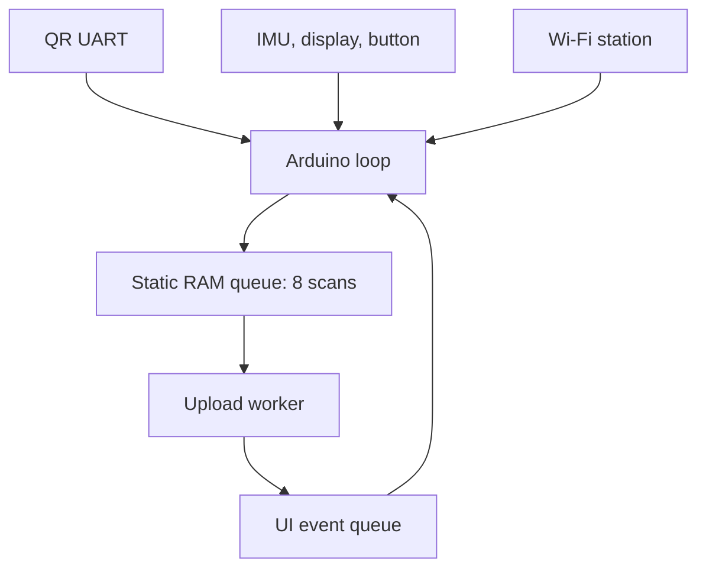
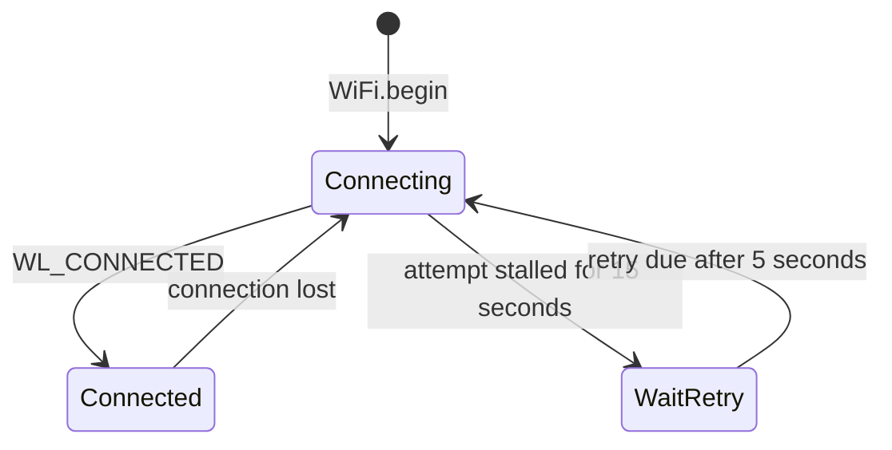
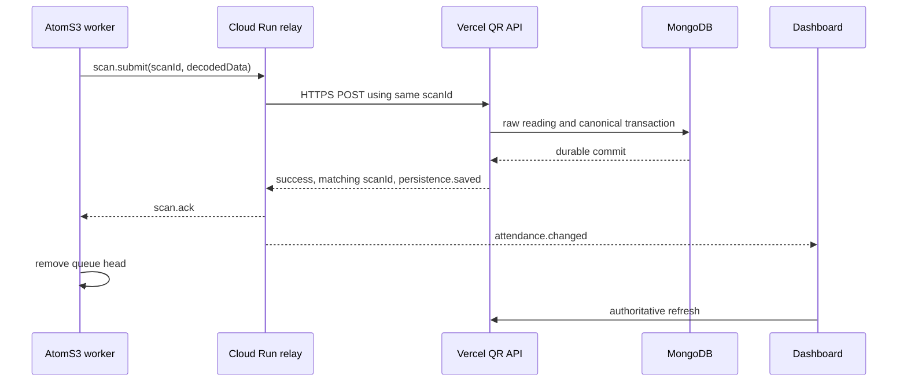
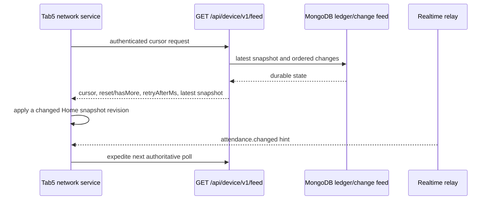

# IITR QR Attendance Logger Architecture

## Purpose

An M5AtomS3 QR scanner records attendance through a low-latency WebSocket relay.
MongoDB is the authoritative store. The relay improves transport latency but never
creates a successful attendance result itself.

## Architectural Guarantees

- A successful scanner acknowledgement represents a completed durable API result,
  not a queued relay message.
- `lib/attendance-ledger.ts` is the canonical transaction boundary for QR and
  Tab5 attendance sources; route handlers do not duplicate ledger policy.
- Realtime notifications are metadata-only wake-up hints. Browsers and Tab5
  displays re-read authenticated API state after receiving a hint.
- Stable scan/event identities make compatible retries idempotent; an identity
  reused with different payload data is rejected as a conflict.
- `AttendanceChange` and `AttendanceFeedCounter` create an ordered durable
  recovery path, while `QrBiometricDeletion` prevents deleted scans returning
  through delayed delivery.

## Repository Boundaries

| Area | Ownership | Important paths |
| --- | --- | --- |
| Presentation | Next.js pages, public/admin UI, client refresh hooks | `app/`, `components/`, `hooks/` |
| HTTP contracts | Request parsing, response mapping, authorization gates | `app/api/` |
| Domain ledger | Idempotency, projections, change creation, durable outcomes | `lib/attendance-ledger.ts` |
| Device security | API key/MAC validation and versioned device contracts | `lib/attendance-device-*.ts` |
| Persistence | Prisma client, MongoDB schema and indexes | `lib/prisma.ts`, `prisma/schema.prisma` |
| Realtime | Token signing, relay publishing, socket protocol | `lib/realtime-*`, `relay/qr-realtime/` |
| Hardware references | AtomS3 scanner implementation and policies | `arduino_code/` |



## Production Topology

```mermaid
flowchart LR
  Scanner[M5AtomS3 QR scanner]
  Relay[Cloud Run relay\nasia-south1]
  Api[Vercel Next.js API\nbom1 Mumbai]
  Database[MongoDB Atlas\nAWS ap-south-1 Mumbai]
  Dashboards[Public and admin dashboards]
  Dosw[DOSW profile service]

  Scanner -->|WSS /v1/realtime| Relay
  Relay -->|HTTPS POST, same scanId| Api
  Api -->|transaction| Database
  Api -. unknown profile only .-> Dosw
  Relay -->|attendance.changed| Dashboards
  Dashboards -->|authenticated refresh| Api
  Dashboards -. 1.5 second polling fallback .-> Api
  Scanner -. relay unavailable before send .->|HTTPS fallback| Api
```

All stateful, latency-sensitive production components are in Mumbai:

| Component | Placement | Reason |
| --- | --- | --- |
| Cloud Run relay | `asia-south1` | Close to scanner and database |
| Vercel functions | `bom1` | Close to MongoDB |
| MongoDB | AWS `ap-south-1` | Durable attendance state |
| Static dashboard assets | Vercel CDN | Close to browser users |

`vercel.json` pins Vercel Functions to `bom1`. The remote build worker location
does not determine where an API request executes.

## Firmware

Primary source files:

- `arduino_code/qr_logger_icc_m5_qr_extended_timeout/qr_logger_icc_m5_qr_extended_timeout.ino`
- `arduino_code/qr_logger_icc_m5_qr_extended_timeout/qr_scanner_policy.h`
- `arduino_code/qr_logger_icc_m5_qr_extended_timeout/qr_relay_policy.h`
- `arduino_code/qr_logger_icc_m5_qr_extended_timeout/qr_wifi_policy.h`

### Hardware and task ownership

- Board: M5AtomS3, ESP32-S3-PICO-1.
- QR unit: M5UnitQRCode UART, ESP RX GPIO 5 and ESP TX GPIO 6 at 115200 baud.
- The main Arduino loop owns QR decoding, screen, IMU, button, and Wi-Fi
  association.
- A pinned FreeRTOS upload worker owns TLS, NTP, WebSocket state, and cloud
  delivery. Network work never blocks QR decoding.
- The queue is eight fixed-size `ScanJob` records in RAM. It is intentionally
  not persistent: an unacknowledged scan is lost after reset or power loss.



The default firmware build uses ignored `secrets.h`. A separately provisioned
QRB-001 build uses ignored `secrets_qrb001.h` only with `QRB001_BUILD`. Neither
credential file may be committed, logged, or placed in browser code or URLs.

### Scan and idle flow

1. While awake, the manual QR trigger is reissued every 1.6 seconds.
2. `readQrFrame()` collects QR-library fragments for up to 450 ms, completes
   after 80 ms quiet, and accepts at most 512 bytes.
3. Firmware accepts only DOSW StudentProxy HTTPS URLs with a nonempty `id`.
4. Repeated identical data within 30 seconds displays `DUP`. This prevents a QR
   kept in front of the scanner from creating concurrent attendance requests.
5. A valid scan gets a random 24-hex `scanId`, is queued, and immediately shows
   `SCANNED`.
6. The worker removes that queue head only after an exact cloud acknowledgement.

After ten seconds without movement, scanner-only idle sends QR trigger-off. It
does not use ESP deep sleep: the display, CPU, Wi-Fi state machine, queue, and
uploader stay active. A button press or sufficient motion enables QR scanning
immediately.

### Wi-Fi recovery

`maintainWiFiConnection()` runs in every loop iteration before the idle return.
It therefore continues while QR scanning is off.



Rules:

- Startup begins Wi-Fi asynchronously; scanner initialization does not wait.
- Wi-Fi modem sleep is disabled. SDK credential persistence is disabled.
- Each association attempt has a 15-second maximum. A stalled attempt is
  disconnected and a fresh `WiFi.begin()` is scheduled five seconds later.
- `WL_IDLE_STATUS` is treated as active only while this firmware has a current
  association attempt. After timeout it cannot block future retries.
- On Wi-Fi loss, the upload worker disconnects and clears the WebSocket state.
  On recovery it starts a fresh TLS WebSocket connection before resuming relay
  traffic.
- A Wi-Fi loss during an active relay acknowledgement wait immediately stops that
  wait, retains the scan, and lets the worker rebuild the transport after Wi-Fi
  returns.
- All recovery is nonblocking. QR/UI processing continues through outage.

Expected serial messages during an outage and recovery include:

```text
WiFi connection lost
WiFi attempt stalled; scheduling reconnect
Starting non-blocking WiFi connection
WiFi restored
WiFi restored: restarting realtime relay transport
Realtime relay ready
```

### Strict device delivery semantics



The worker accepts an acknowledgement only when all conditions hold: HTTP 2xx,
`success: true`, exactly matching `scanId`, and `persistence.status: "saved"`.

- If relay is unavailable before sending, the worker uses direct HTTPS with the
  same scan ID.
- Once a relay submission was sent, it waits up to 25 seconds and retries through
  the relay. It does not launch a competing direct HTTPS request.
- Transient failures remain queued with exponential retry from 2 to 60 seconds.
- Explicit invalid QR, HTTP 413/422, or confirmed scan-ID collision are terminal.
- Provisioning failures such as 400/401/403/noncollision 409 remain queued and
  are rechecked after 60 seconds.

The relay TLS connection uses GTS Root R1. Direct HTTPS uses ISRG Root X1.

## Cloud Run Relay

Source: `relay/qr-realtime/`.

| Endpoint | Function |
| --- | --- |
| `GET /health` | Readiness and protocol version |
| `GET /metrics` | In-memory connection and upstream timing counters |
| `WSS /v1/realtime` | Versioned scanner/dashboard protocol |

Protocol v1 has a 16 KiB message bound, no compression, five-second auth limit,
and fifteen-second ping/pong heartbeat.

Scanner flow:

```text
client -> { v: 1, type: "auth", role: "scanner", deviceId, apiKey, macAddress }
server -> { v: 1, type: "ready", role: "scanner", heartbeatMs }
client -> { v: 1, type: "scan.submit", scanId, decodedData }
server -> { v: 1, type: "scan.ack", scanId, httpStatus, result }
```

`scan.ack` is emitted only after the upstream QR API returns the exact durable
result. Other outcomes are sent as `scan.result` with retry information.

Dashboard flow:

```text
client -> { v: 1, type: "auth", role: "dashboard", token }
server -> { v: 1, type: "ready", role: "dashboard" }
server -> { v: 1, type: "attendance.changed", scanId, deviceId, entryState }
```

Dashboard notifications contain no student profile data. The browser fetches
authoritative data from Vercel after a notification.

Security and reliability controls:

- Scanner API keys exist only in encrypted connection memory and upstream HTTPS.
- The relay authenticates scanners upstream using `device-online` before ready.
- Browser tokens are Vercel-issued, HMAC-SHA256, audience-bound, nonce-bearing,
  and valid for 60 seconds.
- Only HTTPS upstream origins are accepted in production.
- One scanner socket is active per device ID; a new socket replaces an old one.
- Scanner traffic is rate limited to five submits per second.
- A single-flight operation keyed by `deviceId:scanId` joins retries to one
  physical upstream operation. Durable responses are cached briefly; transient
  failures are not cached.
- Fan-out is process-local, so Cloud Run is deliberately one warm, maximum-one
  instance. Do not scale it horizontally without Pub/Sub or Redis fan-out.

## Vercel API and MongoDB

`app/api/qr-biometric-icc/route.ts` is the authoritative scanner endpoint:

1. Verifies enabled `QR_SCANNER` device and hashed API key.
2. Validates/locks supplied MAC. Non-auth activity writes use `after()`.
3. Validates DOSW URL and exact 24-hex scan ID.
4. Looks up indexed `StudentIdentity.doswUrl` before history or external DOSW.
5. Saves `QrBiometricReading` and executes canonical attendance transaction.
6. Returns durable success only for canonical `APPLIED` or
   `SUPPRESSED_DUPLICATE` with matching scan ID and saved persistence status.

Unknown profiles can request DOSW with an eight-second bound. Known students do
not make that external request. Replaying the same ID and payload is idempotent;
the same ID with different data conflicts. Deletion tombstones prevent retries
from restoring deleted scans.

`lib/attendance-ledger.ts` transactionally maintains:

- `StudentIdentity`: enrollment, normalized DOSW URL, profile/photo.
- `AttendanceEvent`: idempotent source event and unique deduplication key.
- `AttendanceProjection`: canonical current IN/OUT state.
- `QrBiometricReading`: raw log synchronized to canonical effective state.
- `AttendanceChange` and `AttendanceFeedCounter`: ordered transactional outbox
  and durable global sequence for dashboard recovery.

`/api/qr-biometric-icc/realtime-token` verifies a browser session and returns a
private no-store relay token. `/api/qr-biometric-icc/changes` is session-authenticated
and returns current durable sequence with `retryAfterMs: 1500`.

Dashboards use WebSocket notification while visible, reconnect with jitter, and
coalesce refreshes. They retain one-and-a-half-second sequence polling and a
periodic full refresh. Missed relay notifications cannot leave a dashboard stale.

## Display States and Recovery

| Screen | Meaning |
| --- | --- |
| `W:OK` | Wi-Fi station connected with IP |
| `W:--` | Wi-Fi disconnected; automatic recovery active |
| `SCANNED` | Valid QR is in RAM queue |
| `IN` / `OUT` / `MARKED` | Exact durable attendance result received |
| `UPLOADED` | Queue drained after acknowledgement |
| `DUP` | Same QR ignored within local 30-second suppression window |
| `OFFLINE` / `RETRY` | Record retained for automatic delivery retry |
| `CONFIG ERR` | Device key, MAC, ID, or payload provisioning issue |
| `Q FULL` | All eight volatile queue slots occupied |
| `QR OFF` | Scanner-only idle; Wi-Fi and uploader continue |

| Failure | Device behavior | Cloud behavior |
| --- | --- | --- |
| Wi-Fi disconnect | Keeps UI/QR active; retries forever without reset | Upload waits; relay resets on recovery |
| Wi-Fi stall | Abort at 15s; fresh attempt after 5s | No manual reset required |
| Relay unavailable before send | Direct HTTPS with same ID | Normal API persistence |
| Relay failure after send | Retains queue head and retries relay | Single-flight prevents duplicate upstream work |
| Vercel/Mongo transient error | Retains record and retries | No ACK or dashboard notification |
| Browser relay disconnect | Browser reconnects while visible | Polling/fallback refresh self-heal |
| Board power loss | Pending RAM records are lost | Earlier acknowledged records stay durable |

## Verification

```powershell
& "C:\Users\rajra\AppData\Local\Programs\Arduino IDE\resources\app\lib\backend\resources\arduino-cli.exe" compile --fqbn m5stack:esp32:m5stack_atoms3 "arduino_code\qr_logger_icc_m5_qr_extended_timeout"
& "C:\Users\rajra\AppData\Local\Programs\Arduino IDE\resources\app\lib\backend\resources\arduino-cli.exe" upload --fqbn m5stack:esp32:m5stack_atoms3 --port COM7 "arduino_code\qr_logger_icc_m5_qr_extended_timeout"
g++ -std=c++17 tests/qr_wifi_policy_test.cpp -o qr_wifi_policy_test.exe
.\qr_wifi_policy_test.exe
npm test
npx tsc --noEmit
npm run build
```

### QRB-001 isolated build

Provision QRB-001 and its MAC lock first. Create ignored `secrets_qrb001.h`
from `secrets_qrb001.h.example` with QRB-001's unique device ID, API key, and
Wi-Fi settings. Do not replace the default `secrets.h` used by QRB-201.

```powershell
$buildPath = Join-Path $env:TEMP "qrb001-firmware-build"
& "C:\Users\rajra\AppData\Local\Programs\Arduino IDE\resources\app\lib\backend\resources\arduino-cli.exe" compile --fqbn m5stack:esp32:m5stack_atoms3 --build-property "compiler.cpp.extra_flags=-DQRB001_BUILD" --build-path $buildPath "arduino_code\qr_logger_icc_m5_qr_extended_timeout"
& "C:\Users\rajra\AppData\Local\Programs\Arduino IDE\resources\app\lib\backend\resources\arduino-cli.exe" upload --fqbn m5stack:esp32:m5stack_atoms3 --port COM8 --build-path $buildPath "arduino_code\qr_logger_icc_m5_qr_extended_timeout"
```

Leave `QRB001_BUILD` undefined for QRB-201; the normal commands above use
`secrets.h`.

Check relay `/health` and `/metrics`. A live Vercel response should contain
`X-Vercel-Id: bom1::bom1::...`. Keep real credentials out of source,
documentation, browser variables, terminal output, and Git.

## Current Device API Workflow

The M5Tab5 uses the versioned `/api/device/v1/` contract. Its primary recovery
loop is deliberately independent of the relay:



| Device endpoint | Responsibility |
| --- | --- |
| `GET /api/device/v1/feed` | Cursor-based changes and authoritative latest-attendance snapshot |
| `POST /api/device/v1/manual-events` | Idempotent upload of locally durable Tab5 events |
| `GET /api/device/v1/students/lookup` | Enrollment lookup for local workflows |
| `GET /api/device/v1/photos/[identityId]` | Controlled profile photo retrieval |
| `GET /api/device/v1/realtime-token` | Short-lived display relay authorization |

The feed can return an authoritative empty latest snapshot. Consumers must replace
their cached snapshot rather than merging omitted fields as a partial patch. A
retention/reset response is a recovery instruction, not a client failure.

## Data Ownership

| Model | Source of truth |
| --- | --- |
| `Device` | Provisioned scanner/Tab5 configuration, API-key hash, MAC binding, status |
| `StudentIdentity` | Normalized enrollment, source URL, profile, and photo reference |
| `AttendanceEvent` | Immutable canonical source event and deduplication identity |
| `AttendanceProjection` | Current IN/OUT state per identity |
| `QrBiometricReading` | Scanner-facing raw record correlated to canonical outcome |
| `AttendanceChange` | Ordered durable outbox item for client recovery |
| `AttendanceFeedCounter` | Monotonic sequence generator for the change feed |
| `QrBiometricDeletion` | Tombstone that blocks delayed retry resurrection |
| `AccessAccount` | Protected dashboard account and password hash |

## Production Change Rules

1. Keep scanner and Tab5 APIs backward-compatible until deployed firmware is
   migrated. Add versioned contract tests for any new field or behavior.
2. Keep polling/feed recovery even when relay connectivity is healthy. Never make
   a WebSocket notification the only path to updated attendance.
3. Review Prisma schema changes, index impact, and backfills as explicit
   operations; application startup must not mutate production data.
4. Configure strong unique `ADMIN_*`, `ACCESS_*`, device, and relay secrets in
   platform secret stores. Example values are development-only.
5. Keep Vercel, MongoDB, Blob, and relay operational telemetry free of credential
   values and student QR payloads.

## References

- [Next.js](https://nextjs.org/docs)
- [Prisma MongoDB connector](https://www.prisma.io/docs/orm/overview/databases/mongodb)
- [Vercel Blob](https://vercel.com/docs/storage/vercel-blob)
- [Cloud Run](https://cloud.google.com/run/docs)
- [`ws` WebSocket library](https://github.com/websockets/ws)
