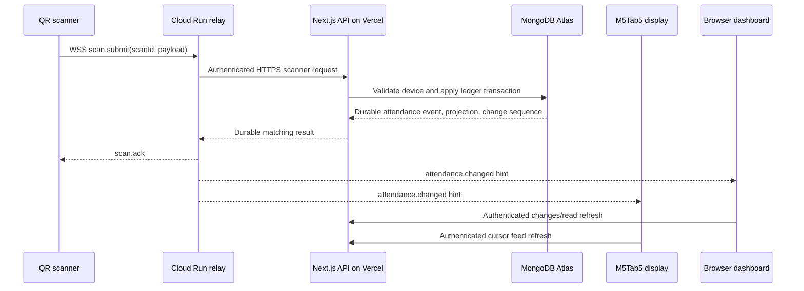

# IITR QR Attendance Logger

Production web and cloud services for QR-based attendance at IIT Roorkee ICC.
The system accepts authenticated scanner events, applies a canonical attendance
ledger, serves live device projections to M5Tab5 displays, and provides public
and protected operational dashboards. MongoDB is the system of record; WebSocket
traffic only improves notification latency and never replaces an authoritative API
read.

See [ARCHITECTURE.md](ARCHITECTURE.md) for component boundaries, data flow, and
Mermaid diagrams. The companion Tab5 firmware repository is deployed separately
and consumes the device API documented here.

## Core Capabilities

- Authenticated QR scanner ingestion with idempotent scan IDs and device API keys.
- Canonical IN/OUT attendance ledger, projection, and ordered change feed.
- Offline-capable device contract for Tab5 feed polling, local-event upload,
  student lookup/history, profile photos, and relay tokens.
- Realtime fan-out through a dedicated Cloud Run WebSocket relay, with polling
  fallbacks for browsers and devices.
- Prisma/MongoDB persistence, Vercel Blob photo storage, browser/admin access
  control, device provisioning, exports, and support workflows.
- Explicit deletion tombstones so deleted scans cannot be recreated by retries.

## System Flow



The `scan.ack` is issued only after the API has completed its durable operation.
Browsers and Tab5 devices always fetch their display data from the API after a
relay hint, so a missed WebSocket message cannot make a client permanently stale.

## Repository Structure

```text
app/                         Next.js App Router pages and API route handlers
  api/device/v1/             Tab5 device API: feed, events, students, photos, token
  api/qr-biometric-icc/      QR scanner/dashboard API and change feed
  admin/                     Protected device and access administration UI
components/                  Dashboard, admin, site, and UI components
hooks/                       Browser realtime and UI hooks
lib/                         Ledger, auth, provisioning, relay, Prisma, photo logic
prisma/schema.prisma         MongoDB data model and indexes
relay/qr-realtime/           Node.js WebSocket relay deployment source
arduino_code/                M5AtomS3 QR scanner reference firmware
scripts/                     Explicit migration/backfill and non-production tools
tests/                       Node test suites for API contracts and ledger behavior
public/                      Static assets
vercel.json                  Vercel Function region configuration
```

## Architecture Summary

| Layer | Responsibility | Key paths |
| --- | --- | --- |
| UI | Public/admin views, protected access, realtime refresh | `app/`, `components/`, `hooks/` |
| API | Validation, auth, device contract, exports, dashboards | `app/api/` |
| Domain | Canonical attendance transaction and idempotency | `lib/attendance-ledger.ts` |
| Persistence | MongoDB models, indexes, Prisma client | `prisma/schema.prisma`, `lib/prisma.ts` |
| Realtime | Token minting, publish client, Cloud Run WebSocket relay | `lib/realtime-*`, `relay/qr-realtime/` |
| Devices | Scanner ingestion and Tab5 cloud contract | `app/api/qr-biometric-icc/`, `app/api/device/v1/` |

## Cloud Services

| Service | Purpose | Configuration |
| --- | --- | --- |
| Vercel | Next.js web app and API routes | `vercel.json` pins Functions to `bom1` |
| MongoDB Atlas | Authoritative attendance, device, identity, and access data | `DATABASE_URL` |
| Vercel Blob | Stored student profile photos | Deployment-managed Blob credentials |
| Cloud Run | `relay/qr-realtime` WebSocket relay | `UPSTREAM_BASE_URL`, `RELAY_TOKEN_SECRET`, `RELAY_PUBLISH_SECRET` |
| DOSW StudentProxy | Optional profile lookup for unknown QR identities | External HTTPS dependency; bounded by API logic |

Production endpoints are configured through deployment variables. Do not place
keys, passwords, deployment URLs with credentials, or device identity values in
source, browser code, documentation, issues, or logs.

## Technology Stack and Packages

- **Runtime:** Node.js 22+ for the relay, Next.js 16.2.7 for the web application
- **Web:** React 19, TypeScript 5, Tailwind CSS 4
- **Persistence:** Prisma 6 with MongoDB
- **UI:** Radix UI, shadcn, Lucide, TanStack Table, Recharts, dnd-kit, Sonner
- **Validation and imaging:** Zod, Sharp, Vercel Blob
- **Realtime:** `ws` 8 in the standalone relay
- **Quality:** Node built-in test runner, ESLint, TypeScript compiler

| Package | Purpose |
| --- | --- |
| `next`, `react`, `react-dom` | App Router application and server rendering |
| `@prisma/client`, `prisma` | Typed MongoDB persistence and schema tooling |
| `@vercel/blob` | Managed student photo storage |
| `zod` | Boundary validation for request and domain inputs |
| `sharp` | Image processing |
| `ws` | Cloud Run WebSocket relay |
| `@tanstack/react-table`, `recharts` | Operational tables and charts |
| `radix-ui`, `shadcn`, `lucide-react`, `sonner` | Accessible UI primitives and feedback |

Refer to `package.json`, `relay/qr-realtime/package.json`, and the committed lock
files for exact package versions.

## Local Setup

### Prerequisites

- Node.js compatible with Next.js 16 and Node 22+ for the relay
- npm and a MongoDB database for integration work
- Required cloud credentials configured outside Git

```powershell
npm ci
Copy-Item .env.example .env.local
```

Set only local, non-committed values in `.env.local`. At minimum configure a valid
`DATABASE_URL` and strong, unique administrator/session values. Do not use the
example credentials in production.

| Variable group | Purpose |
| --- | --- |
| `DATABASE_URL` | MongoDB connection string used by Prisma |
| `NEXT_PUBLIC_APP_URL` | Optional absolute application URL for server helpers |
| `ADMIN_*`, `ACCESS_*` | Administrator/staff bootstrap and session configuration |
| `QR_RELAY_URL`, `QR_RELAY_TOKEN_SECRET` | Browser/device relay token configuration |
| `QR_RELAY_PUBLISH_URL`, `QR_RELAY_PUBLISH_SECRET` | Server-to-relay publication |
| `NEXT_DIST_DIR` | Optional isolated Next build output directory |

The relay has separate deployment variables: `UPSTREAM_BASE_URL`,
`RELAY_TOKEN_SECRET`, `RELAY_PUBLISH_SECRET`, and `PORT`.

## Commands

```powershell
# Development and production validation
npm run dev
npm run lint
npm test
npx tsc --noEmit
npm run build

# Prisma tooling
npm run prisma:generate

# Explicit operational tools; review target data before running
npm run photos:backfill
npm run attendance:backfill
npm run mongo:validate:nonprod

# Relay, from the repository root
npm --prefix relay/qr-realtime ci
npm --prefix relay/qr-realtime test
npm --prefix relay/qr-realtime start
```

`prisma db push` changes the configured database. Run it only through an approved
deployment/data-change workflow, never blindly against production.

## Device API Contract

The versioned `/api/device/v1/` surface supports Tab5 terminals:

| Endpoint | Role |
| --- | --- |
| `GET /feed` | Cursor-based authoritative changes and latest snapshot |
| `POST /manual-events` | Upload locally durable manual/QR attendance records |
| `GET /students/lookup` | Bounded enrollment lookup for local UI flows |
| `GET /photos/[identityId]` | Controlled profile image retrieval |
| `GET /realtime-token` | Short-lived relay authorization token |

Scanner ingress is `/api/qr-biometric-icc/`. The dashboard change feed is
`/api/qr-biometric-icc/changes`; its relay token endpoint is
`/api/qr-biometric-icc/realtime-token`.

## Security and Production Rules

- Device API keys are stored as hashes, never as cleartext database values.
- Device MAC binding, API-version checks, input bounds, and strict URL validation
  are enforced at the API boundary.
- Attendance writes are idempotent by event/scan identity and payload semantics.
- Relay notifications expose only change metadata; clients re-read authoritative
  API data.
- Tokens are short-lived and audience-bound. Use HTTPS/WSS only in production.
- Keep `.env*`, `secrets.h`, build output, `.next*`, `.vercel`, and generated
  Prisma output out of Git. `.gitignore` enforces this policy.
- Rotate any token immediately if it appears in terminal output, Git history,
  screenshots, or a remote URL.

## Delivery Agenda

1. Keep API contracts and ledger schema compatible with deployed scanner and Tab5
   firmware.
2. Add migrations/backfills only as explicit, reviewed operational steps.
3. Keep realtime optional: every client retains polling/feed fallback behavior.
4. Test ledger and route behavior before deployment, then validate a complete scan,
   dashboard refresh, and Tab5 update afterward.
5. Monitor relay health/metrics, Vercel function errors, MongoDB indexes, and
   device provisioning failures without logging credentials or student payloads.

## Reference Documentation

- [Next.js](https://nextjs.org/docs)
- [Prisma MongoDB connector](https://www.prisma.io/docs/orm/overview/databases/mongodb)
- [Vercel Blob](https://vercel.com/docs/storage/vercel-blob)
- [Cloud Run](https://cloud.google.com/run/docs)
- [`ws` WebSocket library](https://github.com/websockets/ws)
